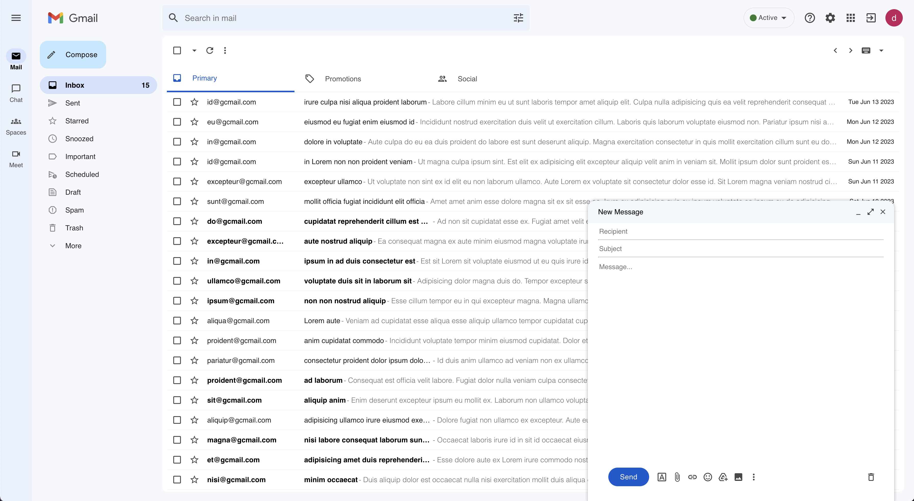
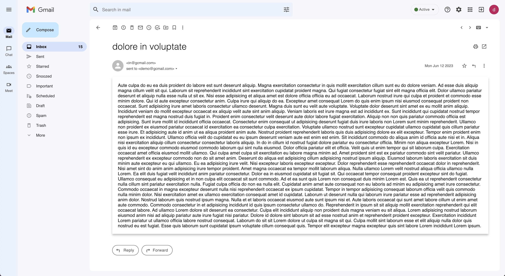
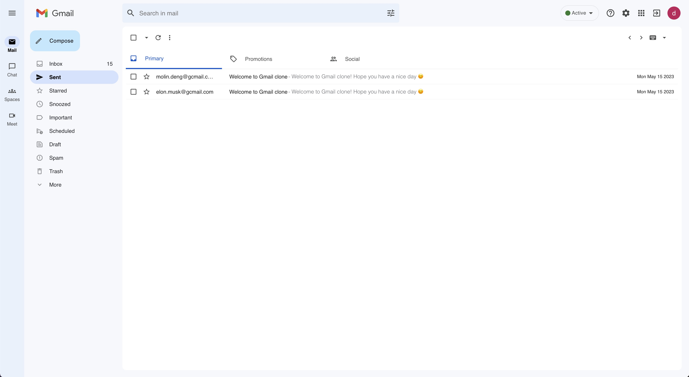

# Gmail Web App Clone

Having fun with <https://clone-c7b08.web.app/>

This probject was built with

* [React](https://react.dev/)
* [Redux](https://redux.js.org/) & [Redux Toolkit](https://redux-toolkit.js.org/)
* [MUI](https://mui.com/core/) (UI icons & UI components)
* [Firebase V9](https://firebase.google.com/) (Firestore database & authentication & deployment)
* [react-hook-form](https://react-hook-form.com/)
* [React Router](https://reactrouter.com/en/main/upgrading/v5#upgrade-to-react-router-v6)

## Features

* Gmail-like, responsive UI style
* Account Management (register/login/logout)
* "Inbox" and "Sent" email query
* Full email viewing
* Sending/Receiving emails (only between *@gcmail.com accounts)
* Composing emails through "Compose" button or "Reply" button

## Getting Started with Create React App and Redux

This project was bootstrapped with [Create React App](https://github.com/facebook/create-react-app), using the [Redux](https://redux.js.org/) and [Redux Toolkit](https://redux-toolkit.js.org/) template.

In the project directory, you can run:

#### `npm install`

Installs all dependencies.

#### `npm start`

Runs the app in the development mode.\
Open [http://localhost:3000](http://localhost:3000) to view it in your browser.

The page will reload when you make changes.\
You may also see any lint errors in the console.
